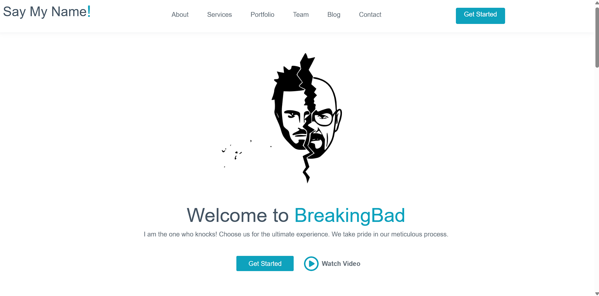

# Welcome to "Say My Name!" – The Ultimate Breaking Bad Experience

Dive into the captivating world of Walter White with our "Say My Name!" web experience. This project is a tribute to the iconic TV show "Breaking Bad," offering fans and newcomers alike a unique digital journey through the double life of chemistry teacher turned meth kingpin, Heisenberg.

## About This Project

This repository contains the source code for the "Say My Name!" website, a fan-made project that combines sleek design with the gritty aesthetic of "Breaking Bad." With meticulous attention to detail, we've crafted a web experience that pays homage to the show's legacy.

## Features

- **Responsive Design**: Crafted for an optimal viewing experience across a wide range of devices.
- **Interactive Elements**: Engage with the elements that made the show unforgettable through interactive website features.
- **Video Content**: Relive the most memorable moments from the series with our curated video selections.
- **Blog Section**: Dive deeper into the "Breaking Bad" universe with articles and fan theories.
- **Contact Form**: Reach out for collaborations or just to share your appreciation for Walter White's journey.

## Get Started

Clone the repo get a local copy up and running.

## Contributing

Are you a fan of "Breaking Bad" with ideas to enhance this experience? Contributions are what make the open-source community such an amazing place to learn, inspire, and create. Any contributions you make are **greatly appreciated**.

1. Fork the Project
2. Create your Feature Branch (`git checkout -b feature/AmazingFeature`)
3. Commit your Changes (`git commit -m 'Add some AmazingFeature'`)
4. Push to the Branch (`git push origin feature/AmazingFeature`)
5. Open a Pull Request

## License

Distributed under the MIT License. See `LICENSE` for more information.

